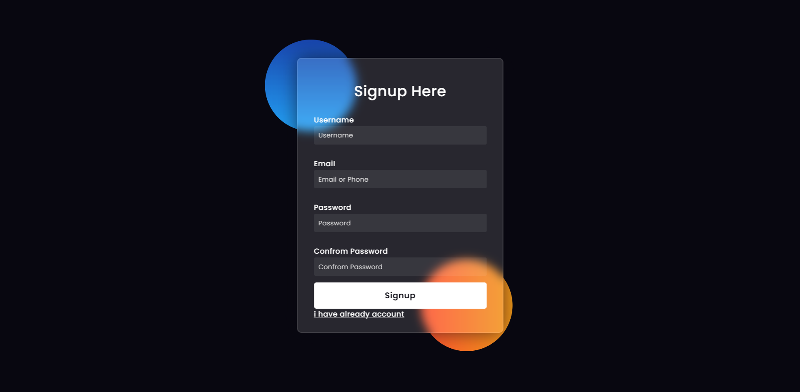
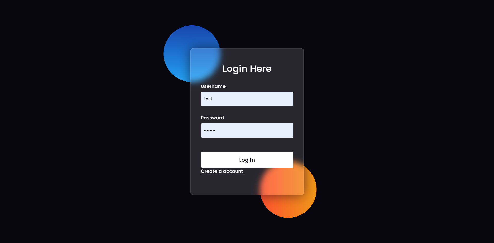
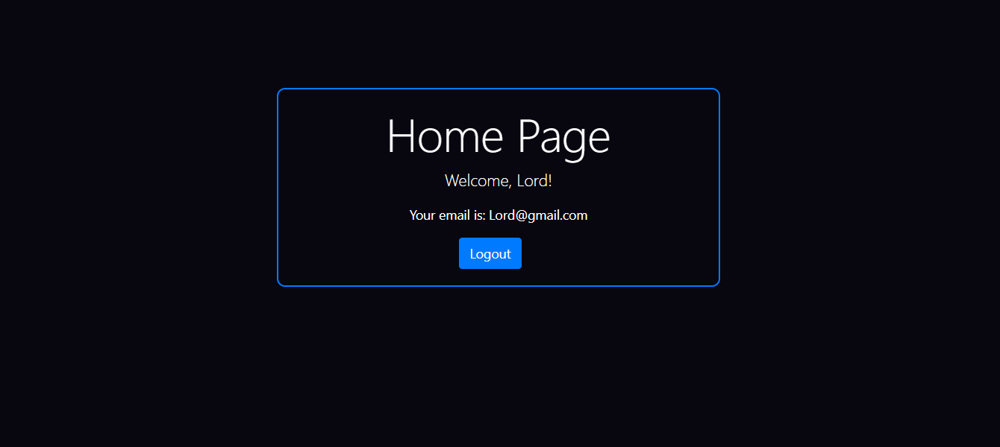

# Django Login/Signup Registration App
This Django application provides user authentication functionalities including login, signup, and registration.

## Features
1. User login with email and password.
2. Protected routes as user cannot open home page without login
3. Python 3.2
4. Django
5. Django allauth (for authentication)

## Installation
1. Clone the repository:
- git clone https://github.com/agnihotri099/Django-signup
- cd registration

2. Run migrations:
- python manage.py migrate

3. Start the development server:
- python manage.py runserver

4. Access the application at http://localhost:8000.

## Screenshots
1.Signup Page

1.Login Page

1.Home Page (Protected route)

